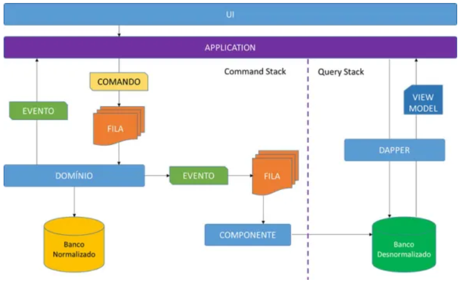

# Projeto: Minha Agenda .NET

## Desafio 

Desenvolver um CRUD para uma agenda (nome, email e telefone) utilizando .NET 6 como backend e frontend Vue.js

**Requisitos:**
- [X] Regras de negócio e validações 
- [X] Utilização de padrões de projeto (repositórios, services, controllers, interfaces, injeção de dependência, etc.) dentro do contexto da aplicação
- [X] Utilização do Entityframework 
- [X] Utilização de libs e frameworks acessórios (ex. Dapper e Automapper) 
- [X] Organização e limpeza do código
- [X] Cobertura de testes de backend 
- [X] Utilização forte de componentes no frontend

**Diferenciais:**
- [X] Utilização do padrão de projeto CQRS
- [X] Utilização de mensageria com RabbitMq
- [ ] Cobertura de testes no front
- [X] Dockerfile da aplicação

## Arquitetura

Foi utilizado um pattern arquitetural chamado CQRS, o principal ganho nesse padrão é a escalabilidade e a separação de responsabilidades.

Essa imagem o que tentei atingir



Ficou faltando o banco não relacional para consulta rápida e cacheada dos dados, que pretendia utilizar o Redis, infelizmente não consegui apenas por falta de tempo.

## Instalação

```bash
$ docker-compose up
```

**Acesso a aplicação**
http://localhost:4200

**Painel administrativo do BD**
http://localhost:8080

**Painel administrativo do RabbitMQ**
http://localhost:15672

### RabbitMQ

Foi implementado, mas por falta de tempo deixei apenas no comando CreateContact, faltando o Update, Delete, e outras filas.

**Acesso RabbitMQ**
```bash
# Necessário rodar com o docker-compose up
$ docker-compose up -d rabbitmq 
```
Url de acesso ao painel administrativo
```
http://localhost:15672
```

### Testes e cobertura

Foram atingidos 80% de cobertura de testes unitários no backend, já no front, infelizmente por falta de tempo para aprender a tecnologia, não implementei nenhum.

### Segurança da API

Foi implementado com Identity Server, em um banco de dados separado da aplicação, com o padrão JWT para autenticação, suportando também autorização baseada em roles.

Usuário admin criado com a aplicação:
Email: admin@test.com
Senha: Asdf1234

### Banco de dados

Foi implementado o ORM do EntityFramework com o MySql.

**Rodar o banco local**
```bash
# Necessário rodar com o docker-compose up
$ docker-compose up -d db 
```

## Code Coverage

### Backend
**Instalação**
```bash
$ dotnet tool install -g dotnet-reportgenerator-globaltool
```

**Gerar nova cobertura**
```bash
$ dotnet test backend/AgendaNetApi/AgendaNet.Tests --collect:"XPlat Code Coverage"
```

**Gerar novo relatório em html**
```bash
$ reportgenerator \
    -reports:"backend/AgendaNetApi/AgendaNet.Tests/TestResults/*/*.xml" \
    -targetdir:"backend/AgendaNetApi/coveragereport" \
    -reporttypes:Html
```
